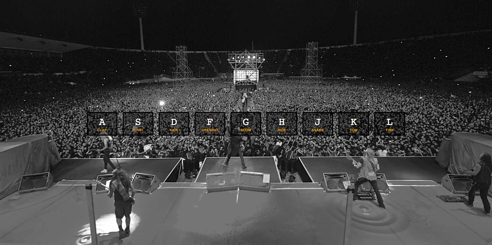

# Drumkit

Drumkit is just a quick little project creating a drum kit that can be played with the keyboard. The project was completed with vanilla javascript.

## Screenshot


## Learning

This project was part 1 of the Javascript30 series by Wes Bos.

## Built With

Vanilla Javascript

## Installation
```
git clone https://github.com/ReggEvans/drumkit.git
cd drumkit
open index.html
```

## License
This project is licensed under the MIT License.
